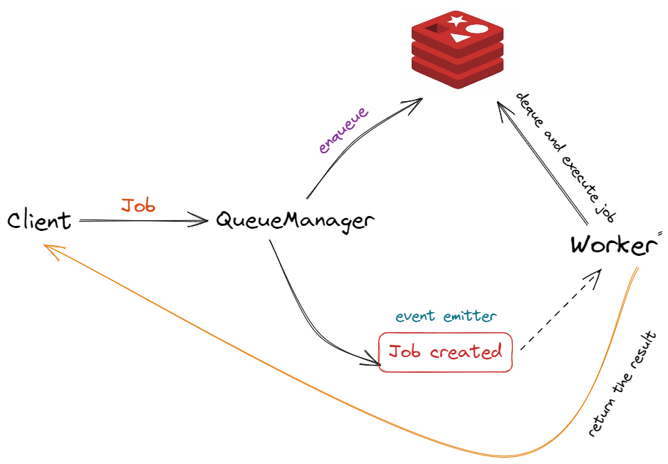

# <span class="title">**_<span class="blue">t</span>Kick_**</span>

The next ground-breaking, earth-shaking, revolutionary background job system.

<div class="badges">


</div>

# How it works

before we jump into how **tKick** works we first need to explore so terminology so we can grasp a better understanding of the topic:

| Term   | Definition                                                                                                                                         |
| ------ | -------------------------------------------------------------------------------------------------------------------------------------------------- |
| Job    | An object that stores information about the the function you want to store ( id,name,queue,job function definition)                                |
| Queue  | Like any queue in the real world, it's a line of objects that are waiting to be served, typically a queue have an `enqueue` and a `dequeue` method |
| Worker | An object that is responsible for grepping jobs from the queue and executing them                                                                  |
| Client | The interface through which you can interact with the system, it encapsulates some low level functionality                                         |

With that out of the way, let's now explore how **tKick** works.



-   When you ask the client to enqueue a job, it sends a request the the underlying queue manager with the provided job.
-   The Queue Manger sends a request for the redis client to enqueue the job in redis queue.
-   An event is emitted carrying some information about the job.
-   On the other side, the worker has subscribed to the "job created" event.
-   Once the worker receives the job information, attached to the event, it begins dequeueing the job from redis queue, executing it and returning it's value.

Interfaces are used extensively here to allow using other queues or data storages such as PostgreSQL or MySQL.

# Trying the App

In the `examples/` folder you will find an example file explaining the basic usage of **tKick**.

If you wish to run the example, run the `dev` script:

```console
$ npm run dev
```

**Please Note** that this command will pull the redis docker image if not exists

# Running Tests

If you wish to run the tests for development purposes, you can run the `test` script:

```console
$ npm test
```

# The intent of the project

This project is primarily inspired by a [challenge]("https://www.codementor.io/projects/tool/background-job-system-atx32exogo") on the [devProjects]("https://www.codementor.io/projects") website.

Most of the solutions were submitted in golang so i thought it would be a good challenge to try a solution in Typescript and Nodejs.

# What does **tKick** mean?

The original author of the project, [Ben Yeh](https://github.com/ocowchun) has named his implementation _**Kick**_ ,So following the footsteps of _**RPC**_ and _**tRPC**_, I decided to name my implementation in Typescript _**tKick**_ 👀.

# Todo

<input type="checkbox" disabled> Implement a multithreaded workers system</input>

<input type="checkbox" disabled>Add scheduling jobs</input>

<style>
    img{
        border-radius:1rem;
    }
    .badges{
        display:flex;
        flex-wrap:wrap;
        gap:0.5rem;
        margin:1rem 0
    }
    .title{
        display:flex;
        justify-content:center;
        font-size:50px;
    }
    .blue{
        color:#0563a6;
    }
</style>
